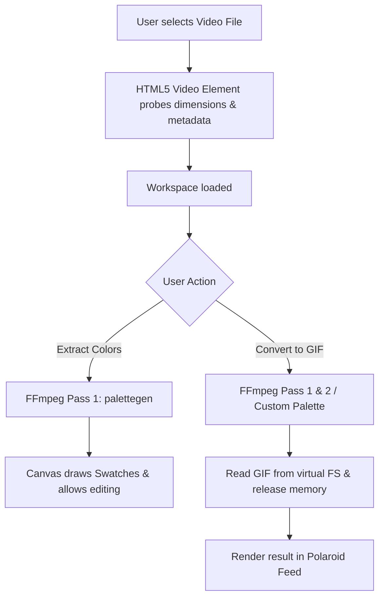

# Kawaii Web Converter — Technical Architecture

This document describes the inner workings and pipeline architecture of the **Kawaii Web Converter** application.

---

## 1. High-Level Flow Diagram



---

## 2. WebAssembly & Threading Security (`SharedArrayBuffer`)

FFmpeg.wasm uses Multi-Threaded WebAssembly features to render video frames concurrently. This requires browsers to support `SharedArrayBuffer`.

Due to Spectre/Meltdown security mitigations, browsers block `SharedArrayBuffer` unless the webpage is served in a **Cross-Origin Isolated** environment. This requires two specific HTTP headers:
*   `Cross-Origin-Opener-Policy: same-origin`
*   `Cross-Origin-Embedder-Policy: require-corp`

### Static Host Workaround: `coi-serviceworker`
Since static hosting sites (like GitHub Pages) do not allow configuring custom response headers easily, we load `coi-serviceworker.js` via a CDN script in the `<head>` of `index.html`. 
1. The service worker intercepts network requests.
2. It appends the required COOP and COEP headers to the response documents.
3. The browser elevates the window environment to `crossOriginIsolated`, enabling the multi-threaded WASM binary to execute successfully.

---

## 3. High-Quality GIF Encoding Pipeline

To generate professional-quality GIFs, standard single-pass encoding is insufficient because the GIF format is limited to a global palette of 256 colors. We utilize a **Two-Pass Video Encoding Pipeline** with FFmpeg's specialized filters:

### Pass 1: Color Analysis (`palettegen`)
FFmpeg parses the video frames to generate a custom 256-color palette containing the most representative colors of the specific video:
```bash
ffmpeg -i input.mov -vf "fps=12,scale=320:-1:flags=lanczos,palettegen=max_colors=64:reserve_transparent=1" -y palette.png
```

### Pass 2: Dithering & Compiling (`paletteuse`)
FFmpeg uses the generated (or custom edited) palette image to map the pixels, applying dithering algorithms (such as Floyd-Steinberg or Bayer matrix) to simulate millions of colors:
```bash
ffmpeg -i input.mov -i palette.png -filter_complex "fps=12,scale=320:-1[x];[x][1:v]paletteuse=alpha_threshold=128:dither=floyd_steinberg" -y output.gif
```

---

## 4. Custom Palette Modification

When the user triggers the "Palette Editor", we:
1. Extract the palette using the WebAssembly compiler.
2. Fetch the generated `palette.png` binary file from the virtual filesystem.
3. Draw the colors on a `<canvas>` element to extract the RGB array.
4. Render interactive swatches in the DOM. When a swatch is clicked:
    * We open a custom Hue/Saturation/Value (HSV) canvas color picker.
    * Updates are rendered back to the source canvas.
5. During conversion, we write the modified canvas pixel buffer back to the virtual filesystem as `palette.png` and instruct the `paletteuse` filter to map pixels using this modified palette.

---

## 5. Memory Management & OOM Prevention

WebAssembly memory resides inside a fixed-size Javascript array buffer (usually capped at 2GB on browser runtimes). When converting large video files, the virtual filesystem (`MEMFS`) can run out of memory (Out of Memory - OOM error).

To prevent this:
1. **Immediate Deletion:** As soon as a conversion finishes (successfully or with errors), the source video and intermediate palette files are deleted from the FFmpeg virtual filesystem using `state.ffmpeg.deleteFile()`.
2. **Blob URLs:** The compiled GIF is exported as a browser-managed Blob URL (`URL.createObjectURL(gifBlob)`), which resides in the browser's garbage-collected memory pool rather than the WebAssembly memory heap.
